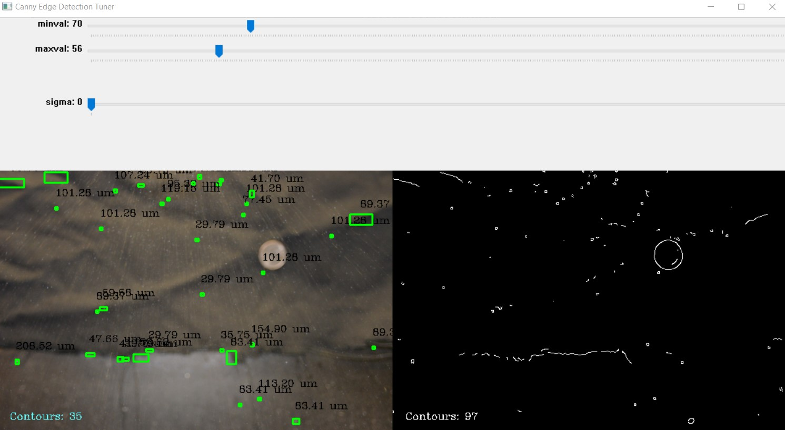

# Spray Quality Monitor For Informed Pesticide Applications

The Spray Quality Monitor for Informed Pesticide Applications is a UGA Capstone project sponsored
by UGA Tifton and kick-started in the 2021 - 2022 academic school year. This project strives to
obtain the spray quality of a pesticide spray in real-time by the use of computer vision
and a camera module to measure spray droplets. In the application, the camera module will be mounted in front of
a boom sprayer so that images of spray droplets can be captured from the applicator.
A microcontroller will then be connected to the camera module so that water droplets can be
extrapolated from the image. Visual feedback to the user will exist in the form of a pie chart
where changes in spray quality can be viewed in realtime. The figure below demonstrates how the
software component of the application will look like once the finalized design is mounted 
onto a boom sprayer.

    

[Abstract](./resources/other/AbstractSprayQualityMonitor.pdf)  
[Poster](./resources/other/ShowcasePoster.pdf)  
[Video](https://youtu.be/II_L44RcShs)

In this program's setup, the program analyzes the spray quality of a series of [pre-captured
photos](./resources/testImages) obtained from a Nikon D600 camera. The program functions by
utilizing openCV and Canny Contour detection to draw bounding boxes around contours that represent
spray droplets within an image. A series of photos will be analyzed by the algorithm at runtime,
and a pie chart detailing the spray quality of the image will be displayed alongside each photo.
Effectively, this program mirrors the application of the Spray Quality Monitor in a field setting
by analyzing a series of pre-captured photos obtained from a test stand created by the capstone team.

# Setup
- A photo of the test stand and the camera placement can be found [here](./resources/other/teststandSetup.jpg)
- Place a U.S. Quarter into the frame to be used as a reference object for measurement calibration
  - Ensure that the reference object is on a flat surface
  - Ensure that the reference object is the largest detectable contour in the photo or else it won't
    be detected as a reference object in the program.
  - Ensure that the coin is on the same plane as the water spray for optimal measurement accuracy.
  - To verify algorithm functionality, ensure that the transfer function outputs the area of the U.S.
    Quarter as .71 inches.
- Ensure that the backdrop is uniform and contrasts the background from the foreground

## Contour Detection
These programs were created to fine tune the parameters of two contour detection algorithms: thresholding
based contour detection and canny edge contour detection. For this application. It was determined that the
canny edge detection algorithm is more suitable because it utilizes pixel gradients as opposed to segmentation
in the thresholding approach. The results for each can be seen in the images below.
### [ThresholdDetectionTuner.py](./contourDetection)

    

Note how the algorithm is also picking up noise from the background. This is because the background is not
uniform and doesn't properly contrast the foreground. The key here is that the algorithm is able to detect
droplets which can be seen in the contour map on the right-hand side of the image with bounding boxes.

### [CannyDetectionTuner.py](./contourDetection)

    

## Create Randomized Spray Dataset
The [GenerateDummyDataset.py](./dummyDatasetGenerator) program located in the [dummyDataset](./dummyDataset) folder
contains a program that generates random particle size distributions using the droplet classification seen in
pesticide spray applications. The`sprayDataset.txt` file details a batch of correctly formatted strings to be
interpreted by the `PieViewer.py` class.

## Real-time Spray Quality Analysis
The`PieViewer.py` class uses a correctly formatted string of values consisting of the spray quality of a pesticide
spray application to be displayed to the user. This class also contains a function to parse through a correctly
formatted file. The purpose of this program is to visualize changes in spray quality and particle size distribution
so that it can be analyzed in realtime.

## Raspberry Pi Camera Calibration
The [PiCamCalibrate.py](./calibrate) program in the [Calibrate](./calibrate) folder is used to calibrate the camera module
attached to a Raspberry Pi so that the user can adjust camera settings by the use of a camera preview. A console
input can then be used to capture and store an image.

## Compilation and Execution
    1) python3 main.py