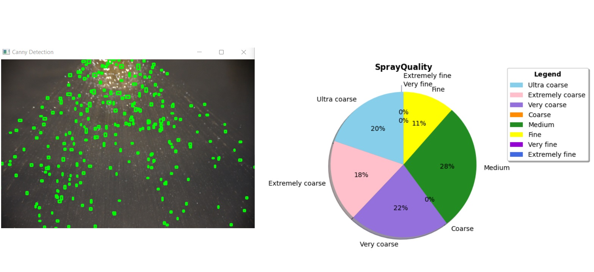
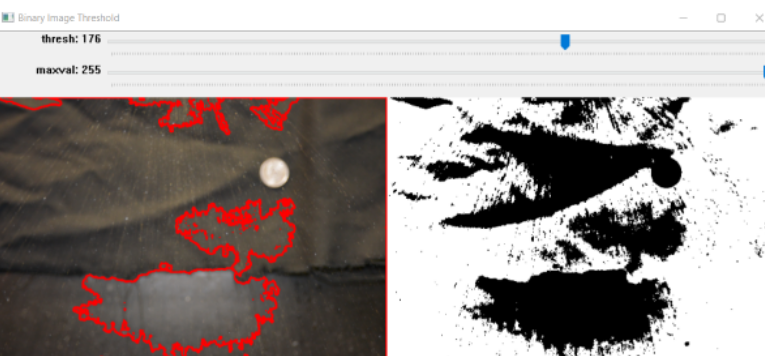
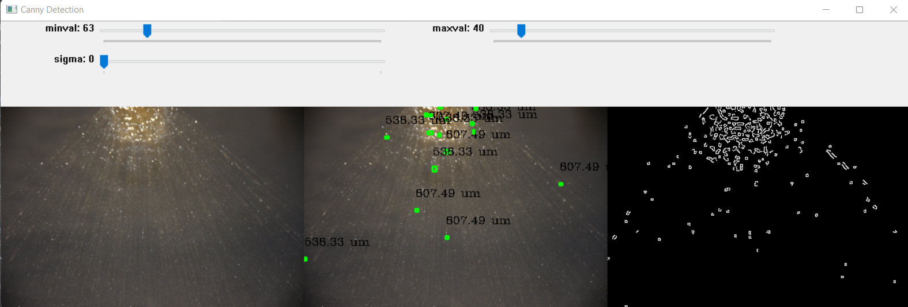

# Spray Quality Monitor

    

# Setup
- Place a U.S Quarter into the frame of the photo for measurement calibration
- Ensure that the backdrop is uniform and contrasts the background from the foreground

## Contour Detection
### [ThresholdContourDetection.py](./contourDetection)

    

### [CannyContourDetection.py](./contourDetection)

    

## Create Randomized Spray Dataset
The [GenerateSprayDataset.py](./dummyDataset) program location in the [dummyDataset](./dummyDataset) folder contains a program that generates random particle size distrubtions of a pesticide spray in a file named `sprayDataset`. These values are used as an input in `PieViewer.py` to debug the program.

## Real-time Spray Quality Analysis
The`PieViewer.py` program  parses through a file or properly formated string containing the distribution  of various particle types so that a real-time analysis of the changes in spray quality distribution can bevisualized.

## Compilation and Exection
    1) python3 main.py